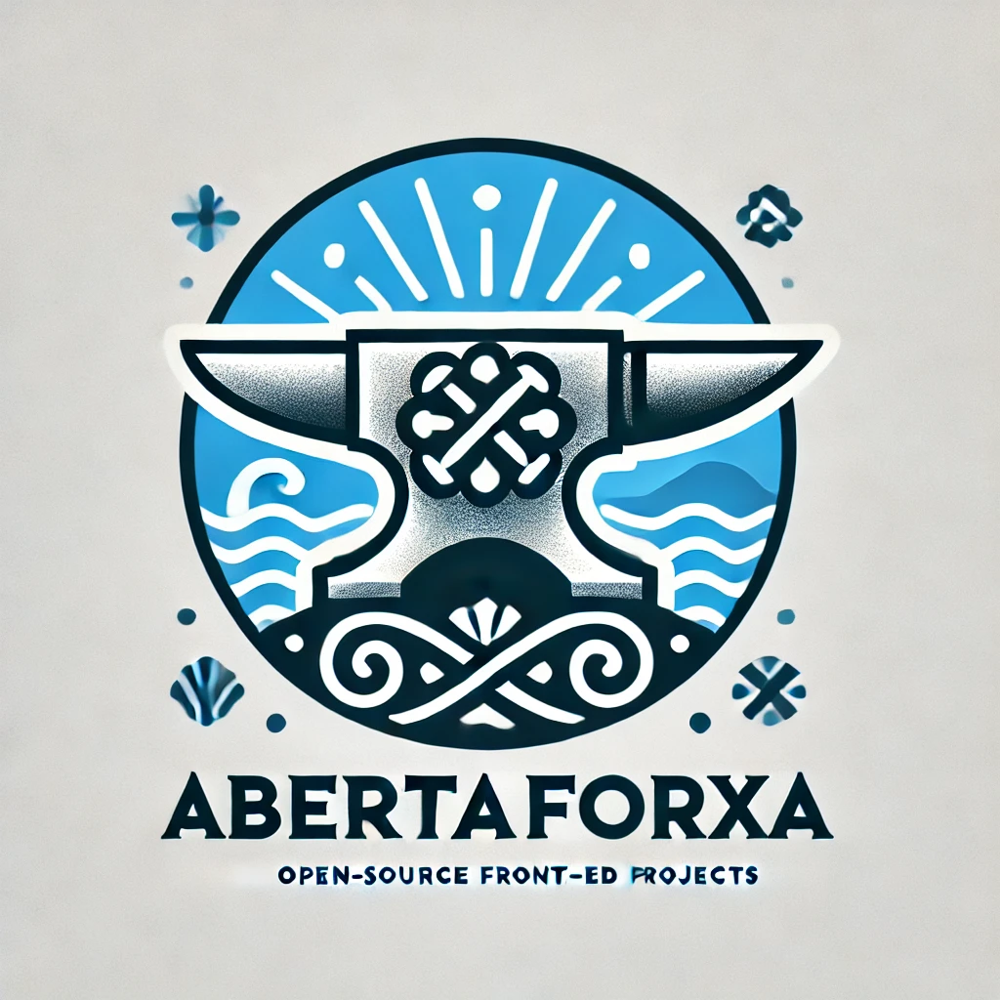

# AbertaForxa

Welcome to **AbertaForxa** – a vibrant community where passionate programmers come together to create, learn, and innovate through open-source projects.

## Table of Contents

- [About Us](#about-us)
- [Our Mission](#our-mission)
- [Get Involved](#get-involved)
  - [Contribute](#contribute)
- [Meet the Team](#meet-the-team)
- [License](#license)

## About Us

AbertaForxa is an organization dedicated to fostering a collaborative environment for developers who are passionate about programming, learning, 
and creating impactful open-source projects. Whether you're a seasoned developer or just starting your coding journey.

## Our Mission

Our mission is to empower programmers by providing a platform where creativity meets collaboration. We aim to:

- **Promote Open Source:** Encourage the development and sharing of open-source software.
- **Foster Learning:** Create opportunities for continuous learning and skill development.
- **Build Community:** Cultivate a supportive and inclusive community of like-minded individuals.
- **Innovate Together:** Drive innovation through collaborative projects and initiatives.

## Get Involved

AbertaForxa thrives on the enthusiasm and contributions of our community members. Here's how you can get involved:

### Contribute

- **Find a Project:** Browse our [GitHub repositories](https://github.com/AbertaForxa) to find a project that interests you.
- **Fork and Clone:** Fork the repository and clone it to your local machine.
- **Submit Pull Requests:** Make your contributions and submit pull requests for review.
- **Report Issues:** Help us improve by reporting bugs or suggesting new features.

## Meet the Team

AbertaForxa is powered by a diverse team of dedicated individuals:

- **Evegeniy Nekrasov** – *developer*  |  [GitHub](https://github.com/EvegeniyNekrasov)

## License

AbertaForxa is an open-source organization. All projects are licensed under the [MIT License](LICENSE).
